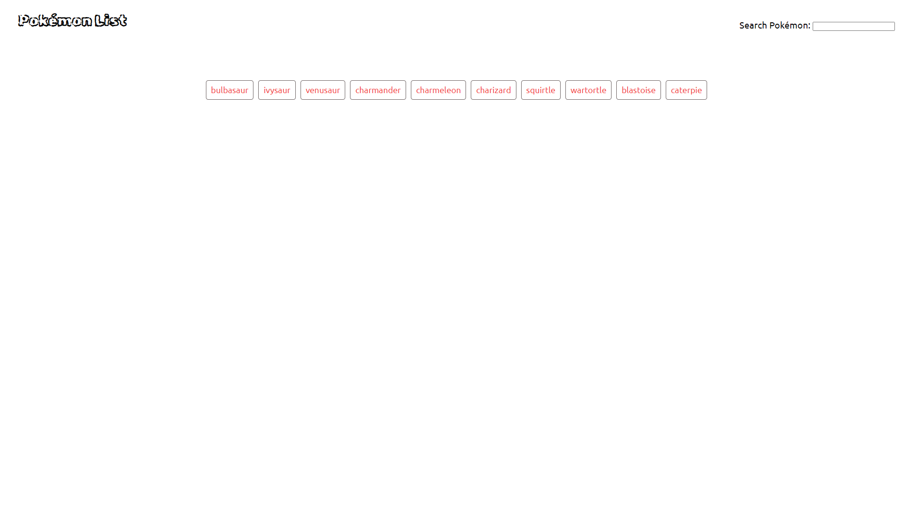
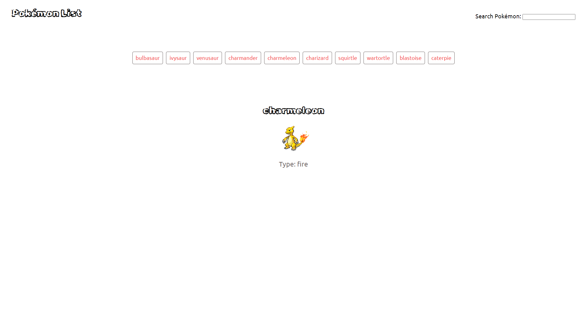
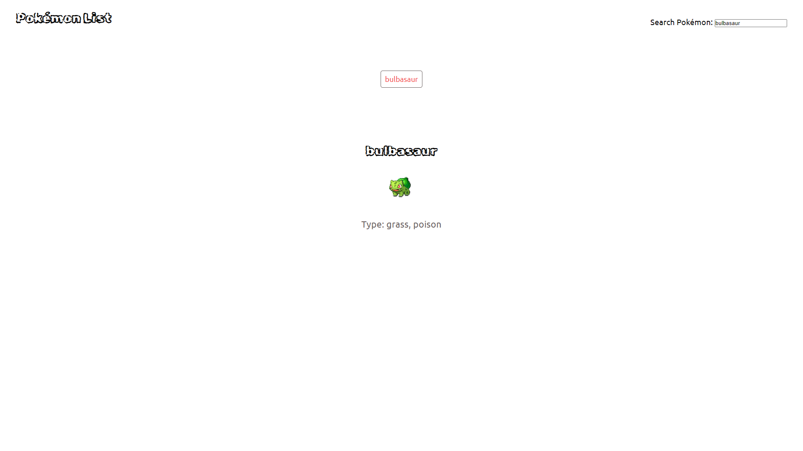

# Pokémon Viewer:
## Description

Pokémon Viewer is a web application that allows users to explore and view information about various Pokémon. With an intuitive interface, users can easily navigate through different Pokémon, view their details, and enjoy a glimpse into the vast Pokémon universe.

## Screenshots

### Home Page


### Pokémon Details


### Search Feature


## Demo

Check out the live demo [here](https://dipjay-das.github.io/Pokemon-Viewer/).

## Installation

To run the Simple Pokémon Viewer locally, follow these steps:

```bash
git clone https://github.com/Dipjay-Das/Pokemon-Viewer.git
cd Pokemon-Viewer
npm install
npm start
